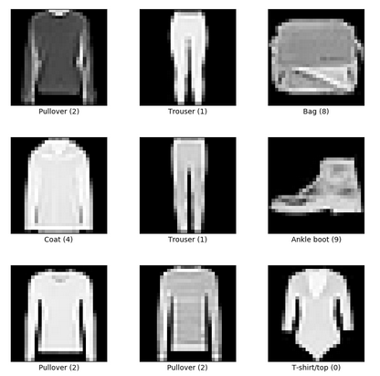

# Exploring Convolutional Layers Through Data and Experiments - TDSE-LAB03

This laboratory explores the fundamental differences between traditional fully connected neural networks and Convolutional Neural Networks (CNNs) through systematic experimentation. The project demonstrates how convolutional layers can extract spatial features from images more effectively than dense layers, leading to improved classification performance on the Fashion MNIST dataset.

## Problem Description

The primary objective of this laboratory is to understand and compare the performance of:
1. **Non-convolutional neural networks** (using only Dense layers)
2. **Convolutional neural networks**

The experiments focus on:
- Analyzing the impact of convolutional layers on model performance
- Investigating the effect of different kernel sizes (3×3 vs 5×5)
- Comparing training dynamics, accuracy, and generalization capabilities

## Dataset Description

### Fashion MNIST Dataset

The **Fashion MNIST** dataset is used for all experiments in this laboratory. It consists of:

- **Training set**: 60,000 grayscale images
- **Test set**: 10,000 grayscale images
- **Image dimensions**: 28×28 pixels
- **Number of classes**: 10 fashion categories
  - T-shirt/top
  - Trouser
  - Pullover
  - Dress
  - Coat
  - Sandal
  - Shirt
  - Sneaker
  - Bag
  - Ankle boot

- **Pixel values**: 0-255 (normalized to 0-1 for training)
- **Format**: Each image is a 28×28 matrix representing grayscale intensities



## Architecture Diagrams

### Base Model (Non-Convolutional)

```
Input (28×28×1)
      ↓
   Flatten
      ↓
Dense (128 neurons, ReLU)
      ↓
Dense (10 neurons, Softmax)
      ↓
   Output (10 classes)
```

**Architecture details**:
- **Input layer**: Flatten layer converts 28×28 image to 784-dimensional vector
- **Hidden layer**: Dense layer with 128 neurons and ReLU activation
- **Output layer**: Dense layer with 10 neurons and Softmax activation
- **Total parameters**: ~100,000 trainable parameters
- **Loss function**: Categorical cross-entropy
- **Optimizer**: Adam

### Convolutional Model

```
Input (28×28×1)
      ↓
Conv2D (32 filters, 3×3 kernel, ReLU)
      ↓
Conv2D (64 filters, 3×3 kernel, ReLU)
      ↓
MaxPooling2D (2×2)
      ↓
   Flatten
      ↓
Dense (64 neurons, ReLU)
      ↓
Dense (10 neurons, Softmax)
      ↓
   Output (10 classes)
```

**Architecture details**:
- **First Conv layer**: 32 filters with 3×3 kernel, learns low-level features (edges, textures)
- **Second Conv layer**: 64 filters with 3×3 kernel, learns complex patterns
- **MaxPooling layer**: 2×2 pooling, reduces spatial dimensions and prevents overfitting
- **Dense layers**: 64 neurons for feature combination, then 10-neuron output with Softmax
- **Loss function**: Categorical cross-entropy
- **Optimizer**: Adam

## Experimental Results

### Base Model (Non-Convolutional)

| Metric | Value |
|--------|-------|
| **Training Accuracy** | ~87% |
| **Validation Accuracy** | ~87% |
| **Training Epochs** | 3 |
| **Batch Size** | 32 |
| **Parameters** | ~100,000 |

**Observations**:
- The model learns meaningful patterns but quickly reaches a performance limit
- Limited ability to capture spatial relationships in images
- Fast training but lower ceiling for accuracy improvement

### Convolutional Model (3×3 kernel)

**Observations**:
- Convolutional layers effectively capture spatial features
- Better generalization to validation data
- Hierarchical feature learning from edges to complex patterns

### Kernel Size Comparison (3×3 vs 5×5)

**Experiment configuration**:
- Same architecture, only kernel size changed
- All other parameters kept constant (filters, optimizer, learning rate, batch size, epochs)

**Expected outcomes**:
- **3×3 kernels**: More localized feature detection, deeper feature hierarchy
- **5×5 kernels**: Larger receptive field, captures broader spatial patterns
- Trade-off between computational cost and feature scale

## Interpretation

### Why Convolutional Layers Outperform Dense Layers

1. **Spatial Feature Extraction**
   - Conv layers preserve spatial relationships between pixels
   - Dense layers flatten the image, losing spatial structure
   - Local connectivity allows detection of features regardless of position

2. **Parameter Efficiency**
   - Weight sharing in convolutional layers reduces parameters
   - Same filter applied across entire image
   - Fewer parameters → less overfitting, faster training

3. **Hierarchical Learning**
   - **First conv layer**: Detects basic features (edges, corners, textures)
   - **Second conv layer**: Combines basic features into complex patterns
   - **Dense layers**: High-level decision making based on extracted features

## Getting Started

These instructions will help you run the experiments on your local machine.

### Prerequisites

Required software and libraries:

```bash
Python 3.7+
numpy
pandas
matplotlib
tensorflow 2.x
scikit-learn
```

### Installing

1. **Clone the repository**

```bash
git clone https://github.com/sebasPuentes/TDSE-LAB03
cd TDSE-LAB03
```

2. **Install required packages**

```bash
pip install numpy pandas matplotlib tensorflow scikit-learn
```

Or using the notebook:

```python
%pip install numpy pandas matplotlib tensorflow scikit-learn
```

3. **Run the Jupyter notebook**

```bash
jupyter notebook tdse_lab03.ipynb
```

### Running the Experiments

1. Open [tdse_lab03.ipynb](tdse_lab03.ipynb) in Jupyter Notebook or VS Code
2. Execute cells sequentially from top to bottom
3. The notebook includes:
   - Data loading and preprocessing
   - Base model (non-convolutional) training and evaluation
   - Convolutional model training and evaluation
   - Kernel size comparison experiments
   - Visualization of results and feature maps

## Built With

* [TensorFlow](https://www.tensorflow.org/) - Deep learning framework
* [Keras](https://keras.io/) - High-level neural networks API
* [NumPy](https://numpy.org/) - Numerical computing library
* [Pandas](https://pandas.pydata.org/) - Data manipulation and analysis
* [Matplotlib](https://matplotlib.org/) - Visualization library
* [scikit-learn](https://scikit-learn.org/) - Machine learning utilities

## Authors

* **Juan Sebastian Puentes Julio**

## Acknowledgments

* Fashion MNIST dataset creators
* TensorFlow and Keras documentation
* TDSE course instructors and materials
